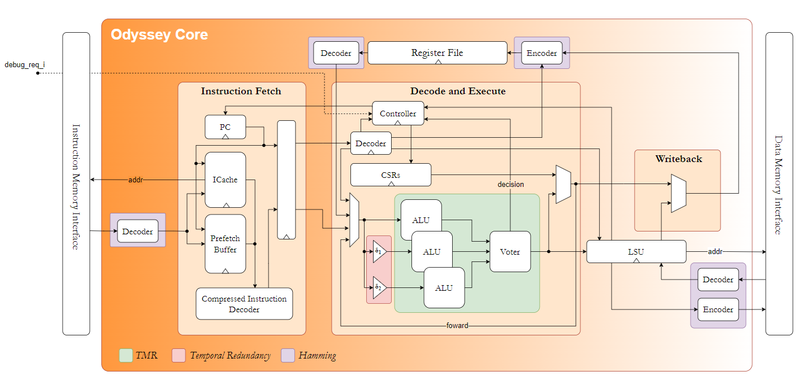

# Introduction

This project comprises the a simple fault-tollerant RISC-V processor for the use in space applications.

# Architecture



# Planning

- [ ] Understand basicaly how it works
    - [ ] Process architecture
        - [ ] Fetch
        - [ ] Decode
        - [ ] ALU
        - [ ] Registe file
        - [ ] LSU (Load-Store-Unit)
    - [ ] Error correction architecture
        - [ ] Encoder and decoder
        - [ ] TMR
    - [ ] RISC-V ISA
    - [ ] OpenSource EDA tools
        - [ ] Simulation
            - [ ] Icarus Verilog
        - [ ] Synthesis
            - [ ] Yosis
        - [ ] P&R

- [ ] Decision phase
    - [ ] # bits
    - [ ] Size of register file
    - [ ] Number of instructions
        - [ ] Which instructions

Tools and project organization:

- I would like the project to be well organized with everything that I have learned until the moment. I believe it would be in my interest if I tried to make the project compatible with Open source EDA tools. The problem is that I don't know which tools to use really. So to start it I would need to learn which tools to use. I believe I should do that before starting the project.
- Maybe it would be wise to set everything up in a docker container for things to be organized.
- Another question is if REALLY be using SystemVerilog for this project (since I'm starting to hate it)
- I think I should put a time limit for how much I can spend in each part of the developing process. The decision part shouldn't be that long.
- Another idea would be to make the processor compatible with FPGAs, buy one and test if it works.
- IDEA: It would be cool to add to the README a script that runs all the testbenches before pushing and updates the number of tests that are passing and which ones aren't.


OpenROAD:
- The OpenROAD project appears to be a viable open source solution for all my current aims with this project. The flow can be carefully seen in their github page. I think I will try to understand it and see how it works.
- The flow uses Docker to easily build the work enviromment which I found very interesting and good. Unfortunatly, I don't have docker installed right now in my machine and it would take about a few hours to download it in the trains internet. I can leave it for latter.

Distribution of time in each part:
- Planning and organization + Enviromment setup: 8 hours
- RTL implementation: 12 hours
- Simulations: 12 hours
- Trouble-shooting: 6 hours

# Study

RISC-V ISA: STOPPED at page 26 !!!

- The most basic RISC-V ISA is the RV32I, that deals with 32 bits integers. It contains 47 instructions but it can be reduced to 38 in simple implementations. This ISA specifies 32 registers but the first one is connected directed to ground. Apart from this register there is the PC (program counter), which also has 32 bits.
- Instructions can be from the R, I, S, B, U or J type. The full specification can be seen in page 23 of the specification.
    - Each instruction type has a specific configuration of bits that has to be respected. The instructions that posses immediate values should be attended to given that they produce different immediates according to the instruction type.
    - I can't yet see the reason of the B type instruction for example. I believe it has something to do with even numbers but I don't know what.
- Arithmetic overflows are normally ignored in the base instruction set. Overflows can be checked using a simple branch instruction.
- Immediate instructions:
    * ADDI rd, rs1, imm - Stands for add immediate. Can also be used to move a value.
    * SLTI rd, rs1, imm - Stands for Set Less Than Immediate. Places 1 in rd if rs1 is less than immediate. Signed versions of the numbers should be compared.
    * SLTIU rd, rs1, imm - Same thing as SLTI but numbers are compared as unsigned values. The immediate should be first sign-extended and then treated as an unsigned number.
    * ANDI - ORI - XORI - Perform usual AND, OR and XOR operations with immediate sign extended values. XORI can be use to perform a NOT operation in a register.
    * SLLI - SRLI - SRAI - Shifts by a constant amount.
    * LUI rd, imm - Load Upper Immediate - Loads the contents of the immediate in to the register of destination, putting zeros on the rest.
    * AUIPC rd, imm - Add upper immediate to PC - Adds the value of the immediate followed by zeros to the program counter. It doens't make

# Work

Planning:

- 17/08/2023 - 2:03 - Started project. Studied about the RISC-V ISA. Most of the time not computed.
- 18/08/2023 - 1:13 - Created a template repository for SystemVerilog based projects. Tough about how to continue the project using OpenSource EDA tools. Formated a few things in the end of the day.
- 20/08/2023 - 0:57 - Started to take a look into prebuild enviromments for chip design. Found openROAD, started to see how it works.
- 22/08/2023 - 1:20 - Took a look at the OpenROAD project more closely and tried to clone it in my PC. I found out that I should be probably cloning the OpenLane project instead since the OpenROAD apears to be a less used repository. I ended up cloning OpenLane and taking a closer look at it. Fantastic!!!

# Setting up

1. You will have to have *Docker* installed in your machine. This program should be available for not root users.
2. Clone this repository using:
```
$ git clone https://github.com/FernandoWelzel/Odyssey.git
```
3. Enter the directory and run *make*.